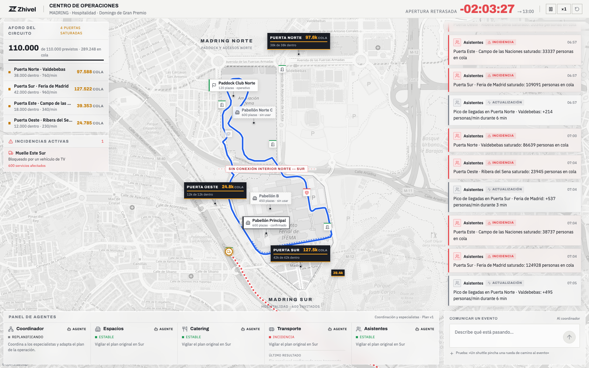
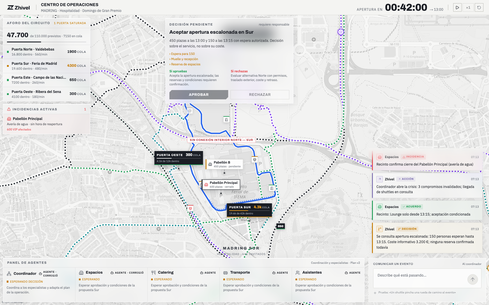
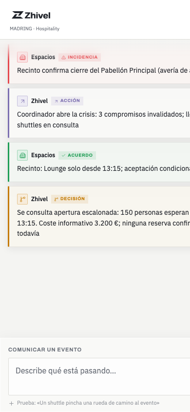

# Zhivel · Centro de Operaciones MADRING

Sistema agéntico que gestiona una crisis de hospitalidad en directo: decide, llama por teléfono, coordina recursos y replanifica cuando el mundo cambia.

Proyecto del equipo **Zhivel** para el track de [HappyRobot](https://happyrobot.ai) en HackSpain 2026 (Madrid, UPM–ETSIT).

## Ejemplos de preguntas

Puedes llamar al **+1 (571) 712-9980** o usar el chatbot.

### Espacios

1. **Fuga de agua en el Pabellón Principal:** 600 invitados se quedan sin recinto a 45 minutos de la apertura.
2. **Cortocircuito en el Pabellón B:** la mitad del aforo queda inutilizable hasta revisión eléctrica.

### Accesos

3. **Cierre de la Puerta Este:** la entrada de Campo de las Naciones se cierra por seguridad; hay que desviar a todos los asistentes que llegan por ahí.
4. **Cola en Acceso Sur 2:** más de 40 minutos de espera; la gente empieza a irse antes de entrar.

### Catering

5. **Cancelación de catering:** el proveedor cancela la entrega prevista en Muelle Sur a última hora.
6. **Acceso bloqueado:** los camiones de catering no pueden descargar en Muelle Este Sur porque un vehículo averiado bloquea el acceso.

### Transporte

7. **Shuttle averiado:** uno de los shuttles se avería de camino al Parking Norte con pasajeros VIP a bordo.
8. **Atasco en Acceso Paddock:** los shuttles no llegan al Paddock Club Norte a la hora prevista.

### Asistentes y staff

9. **Falta de personal:** faltan cuatro personas de recepción en la Zona de Espera Sur; el equipo no da abasto con la llegada de invitados.




## El escenario

Domingo de Gran Premio en **MADRING** (IFEMA). Una avería de agua cierra el Pabellón Principal con 600 invitados a 45 minutos de la apertura: hay que reubicar espacios, rehacer catering y shuttles, y comunicar el plan nuevo. Restricción dura: MADRING Norte y Sur no están conectados por el interior.

Escenario completo: [`escenario/escenario.md`](escenario/escenario.md). Por qué esta idea: [`docs/decisions.md`](docs/decisions.md) (D4).

## Cómo funciona

- **Coordinador** (LLM o workflow de HappyRobot): propone planes, ejecuta acciones y replanifica con cada dato nuevo. Entiende un «no»: si una contraparte rechaza, el espacio queda descartado y el plan cambia.
- **Cuatro especialistas** (Espacios, Catering, Transporte, Asistentes): negocian por teléfono con llamadas de voz reales, SMS y email a través de la plataforma HappyRobot.
- **Motor de mundo determinista**: puertas con aforo y colas, shuttles con rutas OSRM, entregas, incidencias y un reloj acelerable.
- **Panel de operaciones**: mapa en tiempo real, cronología, decisiones pendientes con aprobar/rechazar (el humano sigue al mando) y teléfono editable por agente.
- **Persistencia SQLite** con cola transaccional por `planVersion` y callbacks idempotentes.

## Capturas

| Decisión pendiente de aprobación humana | Vista móvil |
|---|---|
|  |  |

Para regenerarlas con la demo corriendo: `./scripts/screenshots.sh`.

## Requisitos

- **Node.js ≥ 22.13**
- Sin claves de API funciona igual: el coordinador cae al modo `rules` (determinista) y no se hacen llamadas reales.
- Para llamadas y LLM: claves de HappyRobot y/o de un proveedor compatible con OpenAI (ver `.env.example`).

## Arranque rápido

```bash
git clone https://github.com/pdsdm/hackspain.git
cd hackspain
./scripts/setup.sh          # instala dependencias y crea .env
./scripts/demo.sh up-local  # backend :8000 + frontend :5173, sin túnel
```

Abre <http://localhost:5173>. La ejecución arranca **pausada**: pulsa ▶ en la barra superior o:

```bash
curl -X POST http://localhost:8000/simulation/clock \
  -H 'Content-Type: application/json' -d '{"paused":false}'
```

El estado persiste en `backend/data/demo.db`. Logs y PIDs en `.demo/` (ignorado por Git).

### Escenarios de partida (fixtures)

`calm` (defecto), `normal`, `crisis`, `proposal`, `recovered`, `lounge_unavailable`, `pabellon_b_400`:

```bash
./scripts/demo.sh reset pabellon_b_400
```

## Modo real: LLM y llamadas HappyRobot

Copia `.env.example` a `.env` y rellena:

- **Coordinador**: `COGNITION_API_KEY` (u `OPENAI_API_KEY`, `ANTHROPIC_API_KEY`, `HELMCODE_API_KEY`). Alternativa: `COORDINATOR_HARNESS=happyrobot` + `HAPPYROBOT_COORDINATOR_WORKFLOW_ID` para que un workflow de HappyRobot coordine.
- **Voz/SMS/email**: `HAPPYROBOT_API_KEY`, `HAPPYROBOT_HOOK_ESPACIOS/CATERING/TRANSPORTE/ASISTENTES` (o `HAPPYROBOT_HOOK_DEFAULT` para las cuatro), `HAPPYROBOT_TEST_PHONE` (E.164) y `HAPPYROBOT_WEBHOOK_TOKEN`.
- **Callbacks**: `PUBLIC_BASE_URL` con una URL pública HTTPS que llegue al backend (`./scripts/demo.sh up` abre el túnel solo).

Montaje del workflow en la plataforma (trigger, outbound, AI Extract, callback autenticado): [`docs/guia-pruebas.md`](docs/guia-pruebas.md) §4. Cambios pendientes en los workflows: [`agent/happyrobot/CAMBIOS-WORKFLOW.md`](agent/happyrobot/CAMBIOS-WORKFLOW.md).

## Comandos

| Comando | Qué hace |
|---|---|
| `./scripts/setup.sh` | Instala dependencias y crea `.env` |
| `./scripts/demo.sh up-local` | Backend y frontend locales |
| `./scripts/demo.sh up` | Lo mismo + túnel público para callbacks |
| `./scripts/demo.sh status` / `reset` / `down` / `doctor` | Operación y diagnóstico del entorno |
| `make check` | Lint + tests + build de todo el repo |
| `./scripts/screenshots.sh` | Regenera `docs/screenshots/` con Chrome headless |
| `cd backend && npm run dev` | Solo el backend |
| `cd frontend && npm run dev` | Solo el frontend (proxy a `127.0.0.1:8000`) |

## Endpoints principales

| Endpoint | Qué hace |
|---|---|
| `GET /state` · `GET /health` | Estado de la crisis y salud |
| `POST /events` | Comunica un evento (texto libre o estructurado) |
| `POST /interventions` | Aprobar/rechazar decisiones, tomar llamadas |
| `POST /simulation/reset` · `POST /simulation/clock` | Reinicia con un fixture · pausa/velocidad |
| `POST /agents/:area/phone` | Cambia el teléfono de un especialista |
| `POST /workflow/results` | Callback autenticado de HappyRobot |
| `POST /workflow/coordinator/happyrobot/call` | La tool `emitir_llamada` del coordinador |

Contrato completo: [`docs/api-contract.md`](docs/api-contract.md).

## Despliegues

| Componente | Producción | Plataforma |
|---|---|---|
| Frontend | https://zhivel.vercel.app/ | Vercel, proyecto Vite conectado a `main` |
| Backend | https://hackspain-production.up.railway.app/ | Railway, Node.js 22 y una réplica |
| Salud | https://hackspain-production.up.railway.app/health | Debe responder `{ "status": "ok" }` |

Vercel usa `VITE_API_URL` sin barra final. Los secretos de LLM y HappyRobot existen solo en Railway. SQLite vive en el volumen persistente `/data` con `DATABASE_URL=/data/crisis.db`. Railway aporta `RAILWAY_DEPLOYMENT_ID`: cada despliegue nuevo crea una ejecución `calm` pausada; un reinicio del mismo despliegue conserva el progreso.

## Estructura del repositorio

```
.
├── backend/            # API Express 5 + agentes + mundo (Node 22, TypeScript)
│   ├── src/agents/     # coordinador y especialistas
│   ├── src/domain/     # reglas deterministas
│   ├── src/state/      # SQLite, cola transaccional
│   ├── fixtures/       # escenarios reproducibles (calm, crisis, …)
│   └── test/           # runner integrado de Node
├── frontend/           # Panel de operaciones (Vite + React 19 + Tailwind 4 + Leaflet)
├── agent/              # Notas y guiones de los workflows HappyRobot
├── escenario/          # Escenario MADRING completo
├── docs/               # api-contract, decisions, specs, guía de pruebas, capturas
├── scripts/            # setup.sh, demo.sh, screenshots.sh, fixtures
├── TASKS.md            # tablero de tareas del equipo
├── AGENTS.md           # reglas para agentes de IA
└── Makefile            # `make check`
```

## El reto

Track HappyRobot de HackSpain 2026: *¿Puede la IA gestionar una crisis?* Un sistema agéntico (no un chatbot) sobre un escenario que cambia mientras corre, con respuesta de varios pasos, interacción real (llamadas, mensajes, tickets) y una interfaz para supervisar e intervenir. Tres bloques al mismo peso: **cómo decide**, **cómo actúa** y **cómo se supervisa**.

## Cómo trabajamos con agentes

Cada uno usa el agente que quiere (Claude Code, Codex, Cursor, Devin…): todos leen las mismas reglas en `AGENTS.md`. La idea clave es separar lo que no cambia de lo que cambia cada hora:

| Si quieres decirle al agente… | Va en… |
|---|---|
| Una regla estable del proyecto | `AGENTS.md` (o el de `backend/`/`frontend/`) |
| Qué construir ahora y cuándo está hecho | `docs/specs/` |
| Quién hace qué y en qué estado | `TASKS.md` |
| Una decisión y su porqué | `docs/decisions.md` |
| Cómo se hablan backend y frontend | `docs/api-contract.md` |
| Un procedimiento que se repite | `.agents/skills/` |

Ramas, worktrees y PRs: [`CONTRIBUTING.md`](CONTRIBUTING.md).

## Equipo Zhivel

| Nombre | GitHub |
|---|---|
| Zhi Chen Xiang | |
| Pepe Moyano Font | [pdsdm](https://github.com/pdsdm) |
| Carlos Mata Carrillo | |
| Buenaventura Porcel Esquivel | [ventura14](https://github.com/ventura14) |
| Álvaro Iglesias Reina | |

## Licencia

[MIT](LICENSE) © 2026 equipo Zhivel.

---

HackSpain 2026 · Madrid · UPM–ETSIT · 18–20 de septiembre · [@hackspain26](https://x.com/hackspain26)
